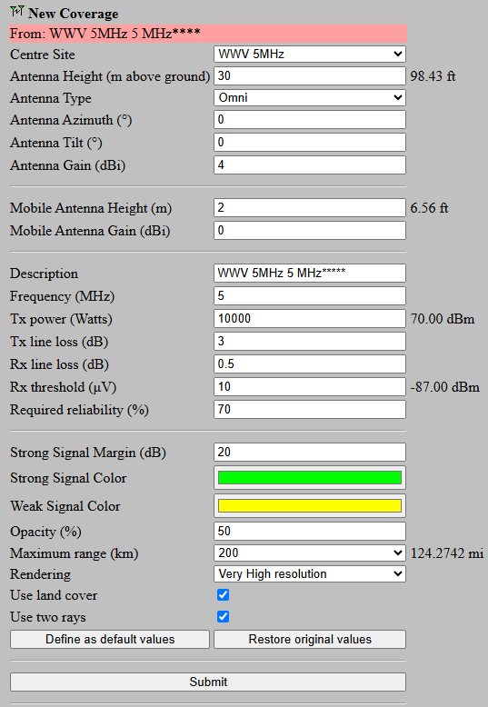
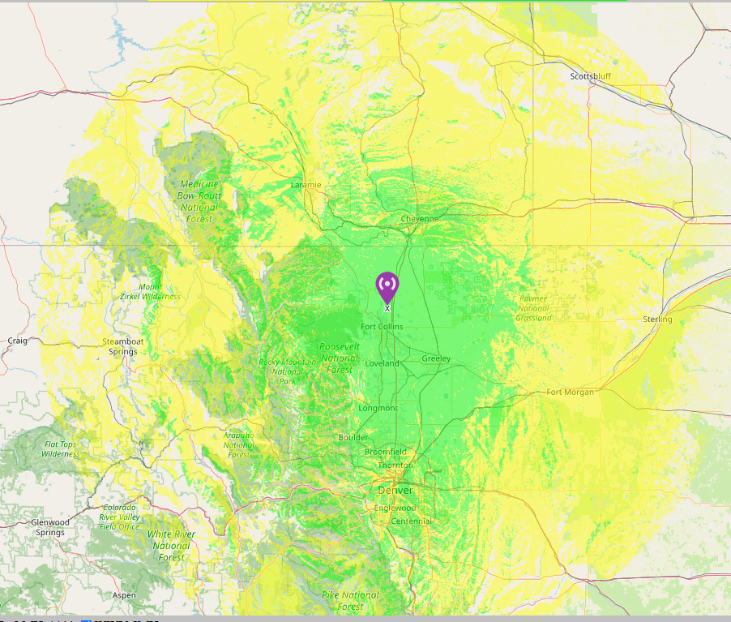
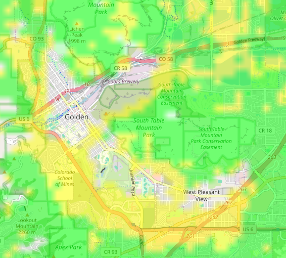

# NIST WWV Signal Mapping

Collection of predicted and field tested signal strength measurements of the NIST WWV Time and Frequency Station, looking specifically at the 5 MHz transmission.

## Overview

Assisting the Microwave Photonics Laboratory at Colorado School of Mines with determining whether their lab is in a dead zone from NIST's WWV Time and Frequency Station located north of Fort Collins, CO.

## Why we mapped the signal

WWV transmits from Fort Collins, Colorado. NIST operates the station. It gives the time and a reference frequency on 2.5, 5, 10, 15, 20, and 25 MHz.

A receiver gets the signal in two ways. The ground wave follows the surface of the earth. It becomes weak as the distance increases. The sky wave goes up, reflects from the ionosphere, and comes back to earth at a longer distance. Between the two, there is an area with a weak signal. The name is the skip zone, or the dead zone. The ground wave is too weak there. The sky wave passes over the area.

Additionally, the ground wave can be disrupted by terrain features that create an RF "shadow", where the signal is much weaker than at another point at the same distance without the terrain obstruction.

Golden, Colorado, where Colorado School of Mines is located, lies between Lookout Mountain to the west, and both North and South Table Mountain to the east. The Microwave Photonics Laboratory is conducting research focused on technology for receiving signals in the very low frequency to very high frequency range.

During their research the Microwave Photonics Laboratory elected to use the NIST WWV 5 MHz time and frequency signal as a consistent reference point. After several attempts to reference the signal, they were unable to receive it.

They wanted to verify whether the signal was present, or whether their device was not actually receiving the signal. I was brought in to help test whether the lack of signal was due to an RF shadow.

## How we predicted the dead zone

We used Radio Mobile, a free RF propagation simulation and mapping program by Roger Coude (VE2DBE). The simulation indicated that North Table Mountain likely creates a shadow over the laboratory.

*Figure 1. The settings used for every Radio Mobile simulation in this study.*

*Figure 2. The Radio Mobile signal simulation overlay at the state scale.*

*Figure 3. The Radio Mobile signal simulation overlay at the city scale. This result points toward an RF shadow, or dead zone, created by North Table Mountain.*

## How we selected the test points

Using the state scale heat map, five test locations were selected. The Radio Mobile simulation showed the likely areas of strongest signal. Scadacore RF Path, a free online line of sight tool, was then used to confirm the path between the WWV antenna and each candidate point.

| Site name | Position (lat, long) | Distance from WWV | Elevation | Reason for selection |
|---|---|---:|---:|---|
| Frederick, CO | 40.10452, -104.94304 | 64.3 km | [ ] | Clear line of sight; a reference point ahead of the terrain |
| Lafayette, CO | 39.98167, -105.06296 | 77.5 km | [ ] | Clear line of sight |
| Arvada, CO | 39.82675, -105.08259 | 94.8 km | [ ] | The last point before North Table Mountain |
| Golden, CO: CSM intramural field | 39.74992, -105.22568 | 104.4 km | [ ] | The predicted shadow area; adjacent to the laboratory |
| Golden, CO: Lookout Mountain Mines "M" pullout | 39.74621, -105.23974 | 105.0 km | [ ] | The same distance, but at a higher elevation |

## Test methodology

### Equipment

- RTL-SDR receiver, [ add the model ], operated in direct sampling mode
- Radioddity HF-009 portable HF antenna
- Radioddity PL-259-M 5 m coaxial cable
- SMA-F to BNC-M to BNC-F to PL-259-M adapters
- Leo Bodnar GPS-disciplined 10 MHz source
- Razer Blade 16 laptop computer

The RTL-SDR does not tune below approximately 24 MHz in its normal mode. It was therefore operated in direct sampling mode, with the signal applied to the Q branch of the analog-to-digital converter. No upconverter was used.

### Software

- SDR#

### Procedure

1. Calibrate the frequency of the RTL-SDR against the Bodnar GPS-disciplined 10 MHz source.
2. Set up the HF-009 antenna at a height of [ add the height ] above ground level. Connect it to the receiver.
3. Set SDR# to 5 MHz.
4. Set the gain to 20.7 dB, the bandwidth to 10 kHz, and the sample rate to 2.4 MS/s. Select AM modulation.
5. Measure the signal-to-noise ratio and the absolute delivered power.
6. Record the I/Q samples.
7. Demodulate the signal and listen for the WWV voice announcements.

The HF-009 antenna gives the RTL-SDR access to the 5 MHz band. The voice announcement provides a second, independent confirmation that the signal is present.

### Measurement conditions

| Item | Value |
|---|---|
| Date of the survey | [ ] |
| Time of day, with time zone | [ ] |
| Weather | [ ] |
| Solar flux / K index, if recorded | [ ] |

The ionosphere changes between day and night, with the season, and with solar activity. These values are necessary to interpret the results.

## Results

[ Add the measurement table here. ]

## Conclusion

[ Add the answer to the question: is the laboratory in a dead zone? ]

## Limitations

- [ Add what the study did not measure ]
- [ Add what could change the result ]

## Data availability

The raw I/Q recordings are approximately 1.5 GB per site. They are too large for this repository. Contact me for a copy: open an issue in this repository, or send a message to my GitHub account.

## References

- [NIST WWV](https://www.nist.gov/pml/time-and-frequency-division/time-distribution/radio-station-wwv)
- [Radio Mobile, by Roger Coude (VE2DBE)](https://www.ve2dbe.com/english1.html)
- [Scadacore RF Path](https://www.scadacore.com/tools/rf-path/)
